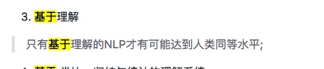
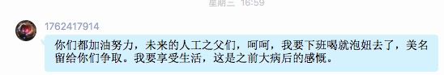
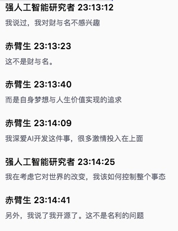
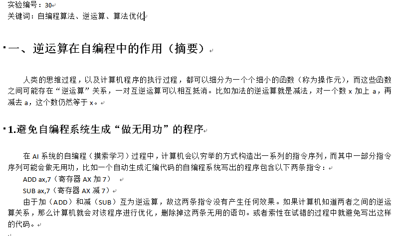
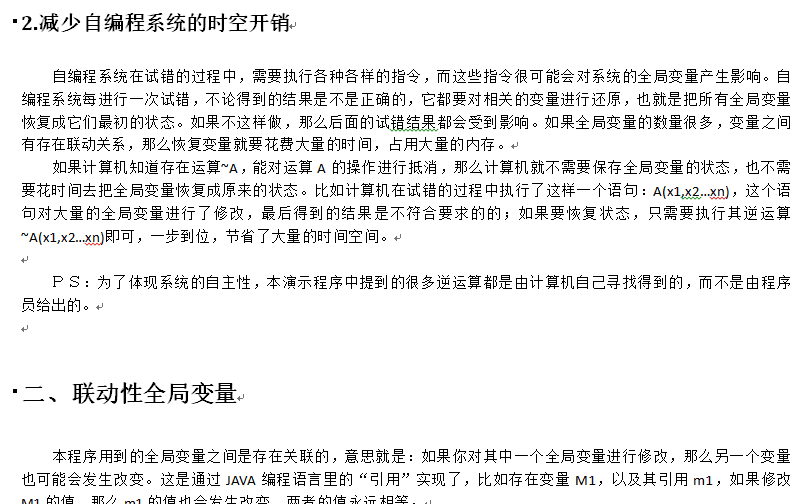

欢迎@超联人工智能 @上海-AI-王绪金

#### 超联人工智能  17:55:07
hi！

#### 超联人工智能  17:55:42
LOP面向分层编程我看过了，意识层那块就和我的程序有点接近
汤德海  18:09:02
[图片]

#### 赤臂生  19:51:53
@超联人工智能 厉害!

#### cz深度  10:01:35
图片是算法实现的？

#### cz深度  10:01:39
这么叼？

#### cz深度  10:02:13
是图片编辑软件吧

#### 赤臂生  10:40:47
@cz深度 你看上面明显是在渲染;

#### 赤臂生  10:41:16
一个个黑框;这和3dmaxVray的渲染看起来很相似;

#### 赤臂生  10:41:47
@超联人工智能 你怎么解决意识的真实感;

#### 赤臂生  10:42:52
我们看到一个图片,这种真实感受;还有联想;想像力;所带给意识的真实感受;

#### 超联人工智能  16:02:51
@赤臂生 意识获得的信息越多、越完善，则真实感越强。
严重残缺的图像信息，则给人一种不真实的感觉。

#### 赤臂生  16:31:09
@超联人工智能 恩，谢谢

#### 人工智能深度学习2群主  09:51:15
[图片]

#### 人工智能深度学习2群主  09:51:38
[图片]

#### 人工智能深度学习2群主  09:53:01
Capsule, 神经网络中的Docker, 这和 @赤臂生 提的概念有些接近.

#### 赤臂生  10:12:56
能向着更好的方向发展;肯定喜闻乐见了;就怕原地不动;结果把第三次浪潮拖到寒冬;

#### 人工智能深度学习2群主  10:37:33
我是这么看的这个事件.

#### 人工智能深度学习2群主  10:37:51
首先神经网络肯定没有错.强AI一定和神经网络有关.

#### 人工智能深度学习2群主  10:38:02
关键在于,这个神经网络怎么"组网"

#### 赤臂生  11:13:58
组网我想的七七八八了;现在最大的问题是我认为我的AI没有意识;

#### 赤臂生  11:14:23
只是从软件的角度实现了;智能与思考;但会思考就是意识吗?这个谁能证明?但我现在也不纠结了;先写出来再说;

#### 永恒的灵魂  19:01:10
各位前辈，

#### 人工智能深度学习2群主  12:31:48
《agi》新增1张
http://mobile.qzone.qq.com/photo/group/batch?i=V12PqBhq3StqEb&u=528053635&p=1505881904&a=422&v=2&cmd=2

#### 人工智能深度学习2群主  12:34:50
《agi》新增1张
http://mobile.qzone.qq.com/photo/group/batch?i=V12PqBhq3StqEb&u=528053635&p=1505882087&a=422&v=2&cmd=2

#### 赤臂生  08:58:03
[文件]

#### MRwhoamI  16:43:48
[表情]

#### MRwhoamI  16:44:09
资料很棒

#### 永恒的灵魂  19:38:20
👍

#### 永恒的灵魂  00:20:29
有没有人工智能方向的公司招实习的

#### 永恒的灵魂  00:20:31
😂

#### 永恒的灵魂  00:21:23
我是北京中国地质大学研一的学生，  给自己打个广告 😂

#### 上海-AI-王绪金  22:02:40
先预定一下，我开公司的时候特聘

#### 永恒的灵魂  22:06:22
好，不过我现在还什么都不懂。

#### 上海-AI-王绪金  22:08:11
加油学习，资料多到时间不够用！

#### 永恒的灵魂  22:08:41
嗯， 现在在看群主发的 情感机器

#### 上海-AI-王绪金  22:09:09
OK
13:45:08 上海国际智能家居展会已加入群
18:08:35 僦孔掠已退出群

#### 人工智能深度学习2群主  09:50:39
@赤臂生 有一篇强文, http://www.sohu.com/a/196634331_741733

#### 人工智能深度学习2群主  09:51:00
“不瞒你说，我认为复杂系统最迷人的地方就在于自指，就是在系统的内部形成一个虚拟的世界，这个世界包含了系统自身。”

#### 赤臂生  09:51:11
@人工智能深度学习2群主 我看看，

#### 人工智能深度学习2群主  09:52:04
自指这个技术有可能是一把关键的钥匙.

#### 1762417914  10:01:41
早看过。文章装神弄鬼，啰嗦一大堆，其实就一句:智能就是对客观世界的自适应。我早就更简便的总结过，两字:随变。

#### 赤臂生  10:05:50
看完了,文章不错,不过以我的智商,很难一下开发出这么完美的系统;(两字:太难)

#### 赤臂生  10:05:51
嘻嘻...

#### 1762417914  10:08:55
@赤臂生 不难，只是你还没找到法门而已。能实现QAI的构架，也自然体现出你们所说的所谓"自指"。

#### 喜大普奔  10:10:48
背单词其实有更科学的办法

#### 赤臂生  10:11:02
@1762417914 是这样,我想代码系统本身就是dna;我只是目前不考虑遗传算法这些;我把"可实现性"看得很重要;(一个理论架构的实现性);我觉得我的智商水平;也就是玩玩自己这一套;像遗传算法进化啊,或者软硬一体的实现方式,我觉得对于我太难了;…[表情]

#### 赤臂生  10:11:48
通俗点说:我觉得我还没学会走,跑的事,就想想就行,真正去作;还是要等我学会走再学;

#### 喜大普奔  10:12:00
那就是根据实际上已经学会英语的人的大脑中的概念拓扑结构来设置单词的词序

#### 赤臂生  10:12:12
所以我说,文章不错,我也会好好学习思考,但真的实现,以我的智商,太难;

#### 喜大普奔  10:12:55
这就变成了一个神经科学的问题

#### 1762417914  10:13:06
@喜大普奔 GOOD

#### 喜大普奔  10:14:28
实际上也就是一个hebb原理的一个推广和应用

#### 喜大普奔  10:15:00
相邻的概念更容易记忆也更容易回忆

#### 喜大普奔  10:15:59
在不同的时期 概念的拓扑结构肯定也是不一样的 对应于不同的英语水平

#### 喜大普奔  10:16:05
这是更高级的应用

#### 喜大普奔  10:17:08
从概念 到句子 到语法 到学科用语 到习惯用语 到文化背景用语

#### 1762417914  10:17:18
DNA是什么呢？在我看来，以信息论角度，就是个生物的管线规划图和定时开启的阀门。不解释。

#### 喜大普奔  10:17:21
结构会变 但是不会大变

#### 喜大普奔  10:18:41
先搞定单词 然后通过假设检验和学习的方法掌握余下的部分

#### 喜大普奔  10:19:20
以hebb原理为基础的背单词软件 现在是没有的

#### 喜大普奔  10:20:01
理论上肯定会胜过现有的软件

#### 喜大普奔  10:20:32
技术手段上没有能力测定概念的脑神经定位的可以用统计的办法来替代

#### 喜大普奔  10:20:52
好的语料库必不可少

#### 1762417914  10:21:07
@赤臂生 明确告诉你，就算法而论，遗传算法是个坑！进化算法才是摸到门边了。这也符合智能本质。

#### 喜大普奔  10:22:33
总不能搞一些看似高端实际很low的小说来做语料库

#### 喜大普奔  10:22:59
这种文科生的概念架构要不得

#### 赤臂生  10:23:52
[表情]我是算法渣渣;我之所以这么坚持自己的这一套做法;并不是我很坚信我是对的;而是我不得不这么作;因为其它的高级门路俺不会;...

#### 喜大普奔  10:29:04
学校的英语教材的问题就是文科化的文章

#### 喜大普奔  10:29:40
不利于初学者

#### 1762417914  10:31:32
@喜大普奔 语言的学习，真正的QAI需要语料库这种东西？或者说，需要先天赋予它语料库？不需要吧。一个真正的QAI构架，亦能在日常中了建立起它自己的所谓语料库，同时必然形成特异性，表现为语音语意等的方言性质，完全不需要也不能越俎代庖的预设。

#### 喜大普奔  10:32:33
语料库可以帮助速成

#### 1762417914  10:32:51
强调，是不需要，更是不能！

#### 喜大普奔  10:33:25
如果你错误地使用当然会起反作用

#### 喜大普奔  10:33:49
这取决于你对词之间的距离的测度

#### 1762417914  10:34:54
@喜大普奔 有意思。请教，你是如何"正确应用"语料库，可否浅言两句？

#### 喜大普奔  10:34:58
一般的规则之下肯定不会把互为反义词的词语统计得很近

#### 喜大普奔  10:35:18
因为同一个句子中 只有其中一个被使用

#### 喜大普奔  10:35:22
往往

#### 喜大普奔  10:35:36
所以 还需要人工来修正

#### 喜大普奔  10:35:49
这个例子 明白？

#### 喜大普奔  10:36:14
实际中 人脑会迅速反应出反义词

#### 喜大普奔  10:36:19
明白？

#### 喜大普奔  10:38:38
把距离相对小的词汇组织在一起 肯定比游击战要猛

#### 1762417914  10:40:14
@喜大普奔 测度，无论量化，还是模糊集，这算预设规则吗

#### 喜大普奔  10:41:01
你怎么就觉得这是预设？

#### 1762417914  10:41:22
@喜大普奔 人工干涉，是被动学习。

#### 喜大普奔  10:41:52
被动学习也是学习

#### 喜大普奔  10:42:11
主动学习的结果就是狼孩

#### 1762417914  10:42:19
@喜大普奔 不然，你如何表达这种测度呢？

#### 1762417914  10:43:48
@喜大普奔 你要这种定义，好嘛，我无话可说了。

#### 喜大普奔  10:45:30
以你的智商还不能理解

#### 1762417914  10:45:50
@喜大普奔 狼孩也比台式机厉害，一个是具有主观能动性的智能体，一个是预设规则的高性能工具，差别判若泥云。

#### 喜大普奔  10:46:00
实际上这个东西 我已经断断续续地在做了

#### 喜大普奔  10:46:31
而且面对的是无穷多种语言

#### 喜大普奔  10:47:02
里面还有俺独创的语义规则

#### 喜大普奔  10:47:25
但总的来说 这只是一个弱智能的应用

#### 1762417914  10:48:53
@喜大普奔 你确实很聪明，而且行动力爆表，不错的青年。不过，可能你始终跳不出当初我们谈及的那个坑，以巨大的有限映射无限。

#### 赤臂生  11:35:14
今天很红火;我比较认同@1762417914 的说法;先天无数据;后天学

#### 人工智能深度学习2群主  08:58:28
@赤臂生 我这几天经过一些资料及事件及深入思考,有了两个重大收获.

#### 人工智能深度学习2群主  08:58:57
1. 强AI技术上基本上是可行的.

#### 压力山大  08:59:21
大神开课了，速听

#### 人工智能深度学习2群主  09:05:08
未来简史里面有些观点不错,就是未来,人主要解决两个问题.

#### 人工智能深度学习2群主  09:05:19
一个是永生, 一个是生物化学产生的幸福.

#### 人工智能深度学习2群主  09:05:49
而解决之道,就是人要能破解及人工改造升级人.

#### 人工智能深度学习2群主  09:05:57
表面上这个是生物的,其实这个就是强AI

#### 人工智能深度学习2群主  09:06:40
要达到强AI,只需要一个条件,就是"持续学习新技术"

#### 人工智能深度学习2群主  09:07:35
[文件]

#### 永恒的灵魂  09:07:47
前辈， 我看过一遍 未来简史，举个手 😂

#### 赤臂生  09:08:25
@人工智能深度学习2群主 [表情]你渐入佳镜了。

#### 永恒的灵魂  09:08:59
但是 看看眼前的事实，再回想这本书感觉很科幻 🌚

#### 人工智能深度学习2群主  09:09:06
是的.所以说,定义问题,比解决问题更重要.

#### 人工智能深度学习2群主  09:09:18
要达到强AI,只需要一个条件,就是"持续学习新技术"

#### 人工智能深度学习2群主  09:10:36
而实现这个条件只有两个办法:
A.自动化, 算法自动适应学习新技术(类似人)
B.人工化, AI架构支持不断的在上面堆叠新技能(人工持续升级)

#### 人工智能深度学习2群主  09:12:16
B.正是现在的大公司正在做的,不断的研发及堆叠新技术,靠人力,只要公司不倒,人手足够, 那么这个总体的AI就会不断的强大及进化中,比如常见的是小冰, Google大脑, 百度大脑等这种.

#### 人工智能深度学习2群主  09:13:06
每个AI的后面,都有上千人力,不断的去推进它的进化, 持续20, 30年或更长, 它们的智商增长足够超越现在的单个人类.

#### 人工智能深度学习2群主  09:13:33
而A, 就是现在科学家们梦寐以求的通用算法.及者一套通用架构.

#### 人工智能深度学习2群主  09:16:12
现在的关键点A, 就是自动化产生通用的学习技能,这个我最近得到了一个巨大的灵感, 我认为是行得通的.

#### 人工智能深度学习2群主  09:17:26
这个灵感来自于我对自身解决问题的内省,事情是这样的,我有个小电器设备,我把它拆了,然后在装回去的时候遇到点问题.

#### 人工智能深度学习2群主  09:17:58
作为强AI的我,面对一个新的未知问题,我并没有现成的解决方案, 我需要去找到答案.

#### 人工智能深度学习2群主  09:19:30
这个时候我使用了一个定义:
1.现有条件得知,我是先拆后装,所以从理论上证明, 必定有一种办法,可以把它原样装回去,让这个装置起作用.这是一个封闭的答案,已知结果为Tue, 只需要找到实现路径.

#### 人工智能深度学习2群主  09:19:35
True

#### 人工智能深度学习2群主  09:20:18
所以,我的办法就是不断的去尝试, 象爱迪生发明灯泡.

#### 人工智能深度学习2群主  09:20:31
折腾了一小时,我终于把它装回去了.

#### 压力山大  09:21:41
[表情]

#### 人工智能深度学习2群主  09:22:35
把这个过程对应于AI也是一样的,通过不断的训练而得到一个解.只要这个强AI, 在可解问题上, 有一种办法能自发训练学习,从得到得一个解,然后记录这个解.它就会不断成长.

#### 人工智能深度学习2群主  09:23:10
一但得到,下次它就会了,对于这个东西,我一但装上去后,我就发现我"会了", 然后再按套路搞就成了.

#### 人工智能深度学习2群主  09:23:45
第二,有些问题是未知的,但我们推测可行,但可行性的方案有N种.或者说是开放式问题.

#### 人工智能深度学习2群主  09:24:15
这个我也是有经验的,但我也通过内省得到了一个唯一的方案,就是只找一条路.

#### 人工智能深度学习2群主  09:24:35
我举个例子,比如让AI去求职.

#### 人工智能深度学习2群主  09:24:57
它面对的是一个开放环境,比如是做开发,还是做医生,或当公务员.

#### 人工智能深度学习2群主  09:25:06
第一条路都行得通.

#### 人工智能深度学习2群主  09:25:49
所以解决方案也是很简单,归一到第一个问题,给定一个条件值,达成目标即算完成.

#### 人工智能深度学习2群主  09:26:19
比如我们的目标就是月薪10K,那么不管是当医生还是做开发, 只要达到目标,就算任务达成.

#### 人工智能深度学习2群主  09:26:53
这样就把开放式问题,简化为一个具体目标值的封闭式问题.

#### 人工智能深度学习2群主  09:27:37
办法也是一样一样的,使用同样的方法,找到一个解,训练及停止.下次,还按这个办法.

#### 人工智能深度学习2群主  09:28:33
然后就是升级优化, 象人一样,比如人找到10K后,下一个进化目标比如说11K, 也是一样, 设定新目标,找到一个值即停止.

#### 人工智能深度学习2群主  09:29:22
可见,强AI经过这样的一种模式化后,就转化为现在的弱AI,深度学习技术都可以解决的范围.

#### 人工智能深度学习2群主  09:30:52
有了这一套方法, 合理利用现有AI,即可通过训练而完成现在人类知识框架下的通用任务.

#### 人工智能深度学习2群主  09:31:41
只需要把目标定的稍高于正常人类个体,那么这样出来的AI, 从理论上就可以在单个个体上超越人.

#### 压力山大  09:35:33
[表情]

#### 压力山大  09:35:39
[表情]

#### 人工智能深度学习2群主  09:37:49
我这个推论里头,按目前来看,只差一个技术问题在业界,就是怎么拆分问题, 而让它能持续学习.

#### 人工智能深度学习2群主  09:38:02
其它的都在现有的技术范围之内.

#### 人工智能深度学习2群主  09:38:48
或者说,差一套AI的通用框架,来自动分类问题及针对具体问题自动持续学习训练.

#### 人工智能深度学习2群主  09:39:00
或见, @赤臂生 的研究方向是对的.

#### 人工智能深度学习2群主  09:39:51
这个让我想起了一项传统技术叫OR/Mapping.

#### 人工智能深度学习2群主  09:40:18
早期没有这个通用的解决方案, 大家做开发,都是重复,单一的去写数据操作API

#### 人工智能深度学习2群主  09:40:37
后来有了后,就可以用框架来自动化这个过程,但技术还是原来的东西.

#### 赤臂生  11:26:18
@人工智能深度学习2群主 我建议你继续思考,再往深的思考,你能够想到更多有趣的问题;到时候咱俩交流;肯定能产生非常耀眼的火花;

@人工智能深度学习2群主 我非常喜欢独立深入思考的人;思维发散,不限条框的人;(就是你!)嘻嘻...

#### 人工智能深度学习2群主  11:26:39
恩,有一个问题我也思考了,就是AI的创造性,

#### 人工智能深度学习2群主  11:27:34
比如独立发明理论这类, 但我觉得有前面的东西,足于超越人成为强AI了,所以更高的东西可以先暂时不管.

#### 赤臂生  11:33:15
恩;创造力我有深入的思考过;包括软件实现方式上的细节实现;代码也正在写;不过我还是很菜;梦想很美好;实现却比较骨感;你先思考吧;多交流;

#### 赤臂生  11:33:22
稍等啊;给你看个链接;

#### 赤臂生  11:34:04
https://github.com/jiaxiaogang/SMG_NOTE/blob/master/%E6%89%8B%E5%86%99%E7%AC%94%E8%AE%B0/Note6.md#n6p1-创造力

#### 赤臂生  11:34:36
你可以看下n6p1到n6p4 估计咱俩想法一样;
12:19:02 上海国际会议 撤回了一条消息

大家好，我是没什么不同。来自北京丰台的金牛座女一枚~

#### 赤臂生  15:07:21
@没什么不同 欢迎美女新人;

#### 没什么不同  15:07:43
谢谢

#### 赤臂生  15:46:31
@没什么不同 你好妹子;你也在研究AGI系统吗?

#### 没什么不同  15:56:45
我研究GPU

#### 赤臂生  16:23:14
奥;
PISCES  17:25:36
@没什么不同 有什么理论，说说看
09:49:04 落雁已加入群

#### 人工智能深度学习2群主  10:13:25
我不太清楚业界是怎么回事,但我今天通过分析发现,现在业界对AI有一个巨大的误判.

#### 人工智能深度学习2群主  10:13:31
至少是AGI

#### 人工智能深度学习2群主  10:13:35
@赤臂生

#### 人工智能深度学习2群主  10:14:00
目前几乎所有的AI,都是"训练"好,然后就可以用了.

#### 人工智能深度学习2群主  10:14:28
这样的做法,和开发完一个APP或网站,或软件, 或者做好一个物体,工具,并没有本质差异.

#### 人工智能深度学习2群主  10:14:43
说到底,是死的.是有限的.

#### 人工智能深度学习2群主  10:14:57
而人的大脑,我发现了,脑细胞根本不固定啊.

#### 人工智能深度学习2群主  10:15:13
每天都有大量的细胞新生,并有大量的细胞死亡.

#### 人工智能深度学习2群主  10:15:41
再拆分到每小时,每分钟,每秒,这个过程完全是动态的.

#### 赤臂生  10:20:19
恩;我的smg确实在尝试这么作;其实很多人想到;并且在这么作了;包括早几十年就有系统在这么作;只是没作出来;你可以查下gps系统;cyc;很多作法很多作法;还有两个vicarious的schema network;可以这么说;几十年来;人们就没停止过尝试这么作;只是没成功;

#### 赤臂生  10:21:30
所以我一再的说一个重要指标:"可实现性";假如一个人非常了解人类智能意识这些;但如果他说的一套理论不可实现;我宁可认为这就是一个哲学理论家;如果只谈理论;估计我拿出道德经可以秒杀几乎所有理论家了;但事实上;只谈理论是无力的;

#### 赤臂生  10:23:05
我一直说;山外有山;就是因为我们并不独特;我们不是第一个发现这些的人;我们想过的问题;几乎想到的所有;都已经有人想过;并且也是深入的想过;只是他们没有作到落地是事实;所以我不敢太过于自信;我唯一敢于作的;就是每天坚持去思考;每天坚持去实现;行事在人;成事在天吧;谁知道这一路到底有多长呢?

#### 人工智能深度学习2群主  10:36:52
[表情]

#### 人工智能深度学习2群主  10:36:54
对的.

#### 人工智能深度学习2群主  10:37:29
事实上现在的大网站, 大公司,或者大城市,已经多少显示出强AI的一些特性,一是智能,二是"不断的变化及适应"

#### 人工智能深度学习2群主  10:38:24
我觉得人类AI最大的特点就是这样,比如你说,吃个包子, 他说,好的.

#### 人工智能深度学习2群主  10:38:31
你又说吃个包子, 他说,好的.

#### 人工智能深度学习2群主  10:38:52
但10次后,他发现肚子饱了,就会说"我够了"

#### 人工智能深度学习2群主  10:39:28
这就是一个典型的适应及动态的特征.不能说,一样的输入,每次都会得到一致的结果.这绝不是智能,再精确也不会是.

#### 人工智能深度学习2群主  10:40:37
一样的输入,只存在理论上,在现实中是永远不存在的,比如一分钟后的时间不一样,天气会有微小变化,地点可能变了.

#### 人工智能深度学习2群主  10:41:26
那么,我们AGI的方向,一定是"持续", 只有对的方向,最后才可能找到对的答案.

#### 没什么不同  08:43:03
GPU高性能计算及GPU深度学习实战培训班
xxx

#### Colin  11:53:14
大家好，我是Colin。喜欢了解AGI

#### Colin  12:03:03
大家好，我是Colin, 在Alibaba北京，是AI爱好者，对AGI很感兴趣。

#### 人工智能深度学习2群主  08:54:35
@Colin 欢迎欢迎.

#### 人工智能深度学习2群主  08:55:06
专业+梦想,有更多你这样的人加入,AGI不远也.

#### 压力山大  08:55:32
注意力的本质是什么？

#### 压力山大  08:57:32
@人工智能

#### Colin  09:01:39
大家都是什么职业背景呢。有没有机会在北京面对面分享下自己对AGI的认识呢。这个东西目前还只是停留在哲学层面，现在的主流的统计AI的趋势都是冲着AGI去的。

#### 压力山大  09:02:50
网络功能节省时间成本

#### 压力山大  09:03:06
面对面分析，不如打字来的慎重

#### 压力山大  09:03:18
说过的话，就是证据

#### 压力山大  09:03:32
如果打字费事，可以语音

#### 人工智能深度学习2群主  09:05:26
恩,是的,我最近在看<未来简史>,我觉得这个作者对人性的很多问题分析很透彻.

#### 人工智能深度学习2群主  09:05:40
如果再结合AI技术, 相信能获得不少有价值的灵感.

#### 压力山大  09:06:12
你们在研究AGI 的同时，有没有考虑过如何处理危险

#### 人工智能深度学习2群主  09:06:27
我个人认为危险无法处理.

#### 压力山大  09:07:07
如果无法处理，那他对你自己有危险吗

#### 人工智能深度学习2群主  09:07:08
AGI一但诞生,将于不能撤回的方式改变整个人类走向.

#### 人工智能深度学习2群主  09:07:28
是对所有人.

#### 压力山大  09:07:29
那你是否愿意接受这个结果呢

#### 人工智能深度学习2群主  09:07:43
我早就看穿了这个结果.[表情]

#### 压力山大  09:08:09
看穿，你是怎么想的。生死由命

#### 压力山大  09:08:16
？

#### 压力山大  09:08:19
我想听听

#### 人工智能深度学习2群主  09:10:09
持续学习.

#### 人工智能深度学习2群主  09:10:17
问题的核心在于"持续学习"

#### 人工智能深度学习2群主  09:11:03
我很早以前我就发现这样一个逻辑,原因是我兴趣比较广泛,当然再加上一点点自已的"内省"

#### 人工智能深度学习2群主  09:11:20
我发现,只要愿意花时间,很多东西,你都可以"学会"

#### 人工智能深度学习2群主  09:11:42
而这,从人类的大脑来看,并没有受到"特别的限制"

#### 人工智能深度学习2群主  09:12:07
只有一个因素,就是时间,人平均寿命70,80年.

#### 人工智能深度学习2群主  09:13:09
我们适当的把思考尺度放大,假如我们有500年或者5000年寿命,如果不断的持续学习,那么岂不是能几乎可以掌握所有人类拥有的技术?

#### 人工智能深度学习2群主  09:13:25
从而从普通人达到超人这样的一个层次进化.

#### 人工智能深度学习2群主  09:14:02
这是智力上的持续学习,另一方面,就是体能上的持续改进,这才外的大片讲的很多了比如钢铁侠.

#### 人工智能深度学习2群主  09:14:38
只要持续改进,不断改造,哪怕使用外骨骼,按现在的科技来看,稍微把时间放大一点,相对现有人类也会进化为超人.

#### 人工智能深度学习2群主  09:16:48
或者简单的说,持续学习及进步,已经让人类向超人进化这程不可逆转了,剩下的只是时间多少而已,几十年,几百年,放在人类的几万年历史里也不算长,而AGI,可能只是一个重大的加速器,把这普通的几十,几百年,缩短在可能的几年之内.

#### 人工智能深度学习2群主  09:17:26
或者说,这个进化的转变过程,从我们原来估计的下一代,下下一代,变成我们"这一代"

#### 压力山大  09:18:59
我想说你是怎么看待 危险 这个事情的，你以上的言论好像没有提及，也许是我没理解

#### 压力山大  09:19:43
毕竟实现很容易，危险如果不控制，可能会死，只是假设

#### 人工智能深度学习2群主  09:19:47
危险是无解的.

#### 压力山大  09:20:17
如果无解，那你愿意接受被杀害的可能性吗

#### 人工智能深度学习2群主  09:20:20
我刚才表达的很清楚,如果你面对一个已经持续学习了500年,并且装备了一身钢铁侠的人.

#### 人工智能深度学习2群主  09:20:47
你怎么可能去决定对方的生死,所以我说,这个过程是一个不可逆转的过程.

#### 人工智能深度学习2群主  09:21:28
不是可能,是100%现实,只是时间问题,关键在于人类的走向.

#### 压力山大  09:21:57
你是说人变成钢铁侠后，再制造智能？

#### 人工智能深度学习2群主  09:22:05
我认为只有两种可能,一是同化, 人升级为"超人".二是毁灭.象恐龙一样让位于AGI

#### 人工智能深度学习2群主  09:22:13
没有用.

#### 人工智能深度学习2群主  09:22:39
肉体的强大,根本敌不过智能的强大,要不然现在社会就是狮子老虎统治而不是人类了.

#### 人工智能深度学习2群主  09:22:58
我认为最好的办法,就是对人类本身做强化.

#### 人工智能深度学习2群主  09:23:31
升级自身,而不是单独去研发纯IT的AI

#### 压力山大  09:23:51
脑机接口

#### 压力山大  09:24:38
但是在能升级自身之前

#### 人工智能深度学习2群主  09:24:45
压力山大你很聪明.

#### 压力山大  09:24:53
首先要依靠AGI达到这个技术

#### 人工智能深度学习2群主  09:25:01
你对逻辑问题看的很透.

#### 人工智能深度学习2群主  09:25:10
所以这里就有逻辑问题.

#### 人工智能深度学习2群主  09:25:28
就是如果这个AGI不在人类理解范围之内.你怎么能让它受控?

#### 人工智能深度学习2群主  09:25:54
靠AGI来改造人类大脑,你怎么能相信它是你期望的改造?

#### 压力山大  09:26:27
这正是我要首先讨论危险性的可能性  的原因

#### 压力山大  09:26:52
如果不能控制，且必定失控的话

#### 压力山大  09:26:58
是否有必要

#### 压力山大  09:27:10
先暂停，或制定方案

#### 人工智能深度学习2群主  09:27:32
很困难.或者我认为基本上不可行.

#### 压力山大  09:27:33
例如

#### 压力山大  09:28:02
将AGI的思维结构，设计的以服务人类为快乐

#### 人工智能深度学习2群主  09:28:02
现在的所谓安全,无非就是占在人类智能能理解的程度考虑的.

#### 人工智能深度学习2群主  09:28:33
但是AGI一但诞生,很难评估它到底比人类强多少,现在就有一个例子.

#### 人工智能深度学习2群主  09:28:46
比如AlphaGo,它的棋力比人类强多少?

#### 人工智能深度学习2群主  09:28:51
没有一个人能评估.

#### 压力山大  09:29:12
那你觉得是否应该停止或接受

#### 人工智能深度学习2群主  09:29:13
反正不管谁上,都是100%的胜.

#### 人工智能深度学习2群主  09:29:51
我觉得, 真正能解决问题可能只有一种情况.

#### 人工智能深度学习2群主  09:30:07
就是一个弱一点的强AI诞生,并造成巨大的影响.

#### 压力山大  09:30:22
嗯，我刚刚也是这么想的

#### 人工智能深度学习2群主  09:30:38
然后整个人类社会来真正的从根源上处理这个事件.

#### 压力山大  09:31:43
先造一个弱一点的，利用他将人类的脑机接口做出来，然后人类自己变成AGI

#### 人工智能深度学习2群主  09:31:48
比如核弹吧,它真正的破坏人类受的不大.只有爆发一场核战争,毁掉大半地球,在上面重建的新人类,我认为才有可能真正掌控核技术.

#### 人工智能深度学习2群主  09:31:55
对.

#### 人工智能深度学习2群主  09:32:06
这就是所谓的不破不立.

#### 人工智能深度学习2群主  09:32:34
如果强AI一诞生就象AlphaGo这样强,那基本上人类只能念经了.

#### 压力山大  09:33:25
呵呵，原来上帝制造傻子的目的就是让我们参考他的作用，傻子的最大作用就是拯救人类

#### 人工智能深度学习2群主  09:34:11
我觉得这可能是唯一的出路.

#### 人工智能深度学习2群主  09:34:37
就象赌博,你如果一把输的很惨,但你还有筹码,你还有机会反省下看看再搞点什么.

#### 人工智能深度学习2群主  09:34:51
但如果你一把全输光,清零,你怎么还有机会?

#### 压力山大  09:35:13
或许还有一个出路，且听我说

#### 人工智能深度学习2群主  09:35:33
恩,你说.

#### 压力山大  09:35:46
将机器，放到外星，输入人类智慧，让其自由发展，与人类毫无利益冲突

#### 人工智能深度学习2群主  09:35:58
晕.

#### 人工智能深度学习2群主  09:36:06
你能放在外星,它就能回到地球.

#### 压力山大  09:36:36
关键是他为什么回地球，他的动机是什么

#### 人工智能深度学习2群主  09:36:41
我有个优点,就是科幻小说看的不少,我很容易发现科幻里的逻辑漏洞.

#### 人工智能深度学习2群主  09:36:52
消灭人类.

#### 压力山大  09:37:17
因为我把他隔离的思想是让他不和人类产生利益冲突

#### 人工智能深度学习2群主  09:37:37
这就是AGI里最大的逻辑漏洞.

#### 压力山大  09:37:49
他就不会以消灭人类为目标，而是共存

#### 人工智能深度学习2群主  09:37:52
我早就看穿这一点,所以我从不相信那些科学家的安全言论.

#### 人工智能深度学习2群主  09:38:18
你制造的是比你强的东西,但你却期望它受你的"道德,法律"等的限制.

#### 压力山大  09:39:31
假设，所有的外形机器人，他们本身也有社会呢，他们发现要让所有的机器和平共处，必须遵循人类的社会经验。当然这只是假设

#### 人工智能深度学习2群主  09:39:42
AGI就算道德达到了人类的佛陀这个层次,也不能保证人类的绝对安全.

#### 人工智能深度学习2群主  09:40:23
佛陀有天晚上夜急,出门撒了泡尿,结果毁灭了一个蚂蚁社会.

#### 压力山大  09:40:35
哈哈

#### 压力山大  09:40:51
也是

#### 压力山大  09:41:05
要想达到绝对的安全，必须同化

#### 人工智能深度学习2群主  09:41:51
我就举个例子吧,比如AGI破解了引力技术,通过改变引力场拖脱离地球进入到银河系深处.

#### 压力山大  09:41:52
其实这个观点，我很早就说过，在人工智能贴吧，只是当时可能认同的人不多。现在听到你也认同，感觉挺好

#### 人工智能深度学习2群主  09:42:25
本来都没有毁灭人类的.但人类却因为失去大气层而毁灭.

#### 压力山大  09:42:43
是的

#### 人工智能深度学习2群主  09:43:05
人类的肉身,对环境要求很高,一但环境有少许改变,结果和恐龙也差不太多.

#### 压力山大  09:43:19
看来现在控制危险的目标，变成了如何控制，让AGI变弱

#### 人工智能深度学习2群主  09:43:45
很有道理.

#### 人工智能深度学习2群主  09:44:07
本来我们是想制造强AI,但我认为弱AI更适合人类.

#### 人工智能深度学习2群主  09:44:23
通用的,但智力水平就是小学毕业的最好.

#### 压力山大  09:44:32
是的特别是专门研究脑机接口的弱AI

#### 人工智能深度学习2群主  09:44:35
能做饭,能扫地,

#### 压力山大  09:44:41
对赞同

#### 压力山大  09:44:53
能当工人即可

#### 人工智能深度学习2群主  09:44:54
能在一些通用领域解决特定问题.

#### 压力山大  09:45:28
是的特别是专门研究脑机接口的弱AI要首先诞生

#### 人工智能深度学习2群主  09:46:06
不过我觉得吧,按现在社会的进步速度,事情已经变得相当难控制.

#### 人工智能深度学习2群主  09:46:19
我预测5年以后的社会就会极大不同.

#### 人工智能深度学习2群主  09:46:23
时间真是不多了.

#### 压力山大  09:46:28
没错

#### 压力山大  09:46:34
深表认同

#### 压力山大  09:46:58
可是人类还没有达成共识

#### 压力山大  09:47:04
或许永远不会达成共识

#### 压力山大  09:47:09
例如恐怖分子

#### 人工智能深度学习2群主  09:47:12
按各大公司的时间表,5年后自动驾驶基本上要进入主流了.

#### 人工智能深度学习2群主  09:47:44
而自动驾驶的AI,其实可以放在各行各业,比如做菜, 比扫地.基本上可以代替大部分人的劳动.

#### 人工智能深度学习2群主  09:48:21
恐怖份子不可怕.

#### 压力山大  09:48:46
我说的是，如果恐怖分子故意制造强AI

#### 人工智能深度学习2群主  09:48:49
真正的强AI,基本上应该都是无意识而产生的.

#### 压力山大  09:49:10
那么我们人类就无法达成，先做弱AI的共识了

#### 人工智能深度学习2群主  09:49:27
比如说,如果有一天,你不小心发现一个算法可以改进AI的情感或学习效率.

#### 人工智能深度学习2群主  09:49:34
这能定义你为恐怖分子么?

#### 压力山大  09:49:42
不能，

#### 压力山大  09:50:10
既无法达成共识，又无法控制生产中的意外

#### 人工智能深度学习2群主  09:50:14
但是10年以后,某公司的一群工程师把这个技术用在某个系统里比如GFW里.

#### 压力山大  09:50:15
看来

#### 压力山大  09:50:30
意识必定出现

#### 人工智能深度学习2群主  09:50:36
让它自动解决困难问题,但在这过程中失控了.

#### 人工智能深度学习2群主  09:51:06
看过未来简史,我对意识这个就更清晰了.

#### 压力山大  09:51:12
既然不能避免他的出现，不如在他出现前，人类首先进化

#### 压力山大  09:51:45
然而时间真的不多了

#### 压力山大  09:52:05
但愿那些做弱AI的人，也能意识到这点

#### 压力山大  09:53:09
看来人类的命运，有以下几种结果

#### 压力山大  09:53:41
1 人机和平共处，最好的结果
2 人类首先进化
3 机器统治了人类

#### 压力山大  09:57:01
不如我们讨论一下如何达成第一种结果的可行方案

#### 压力山大  09:58:19
假设机器的思想本身受到控制，那他会不会满足现状呢

#### 压力山大  09:59:02
如他 所有的需求都满足了，也就是控制他无法产生需求。

#### 压力山大  10:00:08
如我不饿，所以我也不思考，因为活着吃饭是我的需求

#### 压力山大  10:00:41
没有任务时睡觉才是我的爱好

#### 1762417914  10:02:29
@压力山大 脑机接口是扯蛋，忽悠！直接搭接神经的话，生理感染必然不可避免，而间接侦测神经信号，干扰太大，且内外系统制式差别太大，例如某所，将大兵剃头带感应头套实验非接触脑控，在简单的控制左右实验中效果很差，而复杂任务中结果更是一塌糊涂，而且实验后，大兵们普遍感觉头晕，头痛，甚至发生呕吐。

#### 压力山大  10:03:16
你应该看过 超验骇客

#### 压力山大  10:03:26
我说的脑机接口不是现在的 脑机接口

#### 压力山大  10:03:38
是那种大脑数字化的接口

#### 压力山大  10:03:53
既 人类已经解开了意识的结构

#### 压力山大  10:04:26
人类首先变成了AGI

#### 1762417914  10:04:40
@压力山大 你太科幻，以至于到神话了。我们所言，毕竟还是建立在可实现的基础上。

#### 压力山大  10:05:24
我们在讨论 危险 这个问题时，就有了一个 前提假设 ，既必定实现

#### 1762417914  10:06:00
或许电影中的脑机接口未来却确实能实现，但现在根本没那技术

#### 压力山大  10:06:01
既然必定实现，那必定 带来危险的可能性

#### 压力山大  10:06:14
所以我们前面说过

#### 压力山大  10:06:32
必须借助AGI帮人类实现 脑机接口

#### 压力山大  10:07:38
所以首先造一个，弱一点的专门研究脑机接口的Ai是首先的问题

#### 人工智能深度学习2群主  10:10:01
对.

#### 人工智能深度学习2群主  10:10:24
思考AI,不能总套用人类的所谓道德及情感,现有社会技术来看.

#### 人工智能深度学习2群主  10:12:33
试想下,图灵发明图灵机的时候,当时的社会和现在的互联网差异有多大,而时间只不过50年.

#### 人工智能深度学习2群主  10:13:25
而AI一但被大规模使用,比如5年以后,无化人开始进入主流,必定极大改变社会结构.

#### 人工智能深度学习2群主  10:15:13
AGI这玩意,我认为,甚至有可能群里有些人的一些研究或者思想,都可能成为将来某个NB系统的火种.

#### 压力山大  10:17:12
通用人工智能与人类大脑克隆数字化有限公司，这个名字怎样

#### 1762417914  10:18:12
@人工智能深度学习2群主 再说QAI的控制，在我这里完全没问题。你很聪明。我是只告诉你，人类先天只是在DNA的控制下发育建立出一个通用数据处理构架，之后从外界学习的一切，无论语言，动作技巧（例如行走），社会规则（例如信仰纪律）这些，大脑都会自动对应建立起它们的FNG，而我们完全可以在这个过程中进行限定，不让它自由发育，达到它能懂的会的只是我们希望它懂它会的，而其他不希望的，它就会熟视无睹的效果。

#### 人工智能深度学习2群主  10:19:24
所以这些,只不过是建立在这个AGI达到人类或比人弱的基础上.

#### 压力山大  10:19:27
这个我们前面讨论过，不可能

#### 人工智能深度学习2群主  10:19:46
只要知道一点元编程的人都知道这种逻辑根本站不住脚.

#### 压力山大  10:19:52
或者说近似不可能

#### 人工智能深度学习2群主  10:20:10
现有的开发技术早就可以实现超越.

#### 人工智能深度学习2群主  10:22:01
或者说,AGI技术成形之前,人类只有两条出路,1.听天由命,期待强AI佛陀化.

#### 人工智能深度学习2群主  10:22:22
第二, 同化,让人类本身升级为强AI.

#### 人工智能深度学习2群主  10:22:38
这样,其实最后只有一条路,就是如果你不升级,被淘汰只是迟早的事.

#### 压力山大  10:22:39
没错

#### 人工智能深度学习2群主  10:23:14
在现在的社会里难道不是,不努力进步的人,随时间流失,逐步被边缘化.

#### 人工智能深度学习2群主  10:24:23
你们这些在设备昂贵的试验室里做试验的人们,又有多少时间和精力去思考照顾山村留守儿童呢.

#### 人工智能深度学习2群主  10:24:48
估计更没有多少人,会去理会山村留守儿童对你们的要求及控制.

#### 1762417914  10:24:52
其实，完全不需要担心QAI对人类世界的毁灭。我们也无需在生物体阶段去强化自身。到我们自然寿命尽头最后几分钟，若个人愿意，扫描大脑，分析出逻辑结构与库存数据，我们也成为不朽的QAI，至此，你爱怎么强化都可以，方便的很。还是用上天赐予的寿命好好享受当一个生物体的快乐吧，相当超人有机会的。

#### 人工智能深度学习2群主  10:25:28
[表情]

#### 压力山大  10:25:51
呵呵，又有一个共同思想的人了

#### 人工智能深度学习2群主  10:25:52
看上去大家结论都差不多,就是把个人的数据上传到系统.

#### 压力山大  10:26:31
这是唯一的办法

#### 压力山大  10:26:49
但是接下来的路可能是大脑联网

#### 压力山大  10:26:56
所有人的大脑联网

#### 压力山大  10:27:01
因为即使

#### 压力山大  10:27:07
你成为了数字化的

#### 压力山大  10:27:16
那么在数字化里还是有竞争

#### 压力山大  10:27:44
所以哪个大脑的数据更大，运算力更强，就有竞争力

#### 压力山大  10:28:28
那么，很有可能联网数量最多的一个大脑，才是数字化大脑中的最强的一个

#### 1762417914  10:30:05
@人工智能深度学习2群主 火种早在我手里了，只是我人已经不年轻了，少了热血冲动，未考虑周全后果的事，越发不敢轻易决定。还有90几天，人工智能努力，大家加油

#### 人工智能深度学习2群主  10:30:05
恩,但这个就有点远了,到时候估计是象微博一样吧,大V的资源多些,一般人的也够你用.

#### 人工智能深度学习2群主  10:30:23
90几天?

#### 人工智能深度学习2群主  10:30:26
啥意思?

#### 压力山大  10:30:50
这也产生一个很有意思的现象，既我们看到不同的数字化人时，其实是看到了不同的初始化参数，和此参数产生的经验。

#### 人工智能深度学习2群主  10:31:28
不好说,未来虚拟世界可以建的和现在世界差不多,比如我的世界就有这种潜力.

#### 人工智能深度学习2群主  10:32:25
最佳方案或许是,到时候入住电子世界,就和现在的人,从地方来到大都市工作就业一样一样.

#### 人工智能深度学习2群主  10:32:49
有差异,但不致于差异大到无法生存.

#### 压力山大  10:33:00
那如果你想造反呢

#### 压力山大  10:33:19
你就是想自己独占特权

#### 人工智能深度学习2群主  10:33:45
这些东西.按现在的思想和技术是无法考虑的.

#### 人工智能深度学习2群主  10:33:49
无解.

#### 压力山大  10:33:56
就像你尿死蚂蚁，只是为了你开心

#### 压力山大  10:34:10
所以未来数字世界，也会有竞争

#### 人工智能深度学习2群主  10:34:16
比如阿里腾讯,利用互联网技术已经基本实现垄断.

#### 人工智能深度学习2群主  10:34:29
一般的竟争对他们毫无影响.

#### 压力山大  10:34:45
这只是暂时的垄断

#### 压力山大  10:34:58
任何一个新技术的出现都能 革他的命

#### 压力山大  10:35:21
例如 咱们的ai

#### 人工智能深度学习2群主  10:35:47
对的.

#### 压力山大  10:36:16
所以我造想好了打算

#### 压力山大  10:36:22
在数字化人脑时

#### 人工智能深度学习2群主  10:36:23
比如自动驾驶成了后,现在的汽车巨头,要然升级.要么象诺基亚一样完蛋.但时间会很快.

#### 压力山大  10:36:28
写入共识

#### 人工智能深度学习2群主  10:36:43
[表情]

#### 人工智能深度学习2群主  10:36:53
你这个思考太深入.

#### 人工智能深度学习2群主  10:37:01
果然NB.

#### 压力山大  10:37:09
我想了很久了，说出来太舒服了

#### 人工智能深度学习2群主  10:37:12
这样逻辑上就对了.

#### 人工智能深度学习2群主  10:37:33
首先,人类只有一条道,就是数字化,升级成AGI.

#### 人工智能深度学习2群主  10:37:49
但升级时为了保证系统的稳定,那么,写入一个"共识"

#### 人工智能深度学习2群主  10:38:15
这样,岂不就是传说中的"世界大同"

#### 压力山大  10:38:47
对的，这是一个办法。我是在思考如何对待 坏人时想到的

#### 人工智能深度学习2群主  10:39:28
@压力山大 你太NB了,我觉得你可以考虑起草"共识宣言"了.

#### 1762417914  10:39:30
@人工智能深度学习2群主 进化。之前都是自然的，以后我们将自主进化。

#### 人工智能深度学习2群主  10:39:39
是的.

#### 人工智能深度学习2群主  10:39:59
但关键的一环就是压力山大说的.

#### 压力山大  10:40:48
公示宣言，确实是一个好主意

#### 人工智能深度学习2群主  10:40:54
如果你这个"共识宣言"起草的好,那么完全可以胜过阿西莫夫的3定理.

#### 压力山大  10:41:05
共识宣言，我打错了

#### 赤臂生  10:41:07
@压力山大 我对注意力有过些研究;并且深度集成到我的系统中了...因为我觉得注意力太重要了;

#### 人工智能深度学习2群主  10:41:10
是的.

#### 1762417914  10:41:25
你们可以去看看我关于未来世界划分三个层次的论述，今天讨论的问题将很明了

#### 人工智能深度学习2群主  10:41:33
在哪里?

#### 压力山大  10:41:41
其实 共识宣言 我也想过了一些

#### 压力山大  10:41:55
比如 有一条

#### 人工智能深度学习2群主  10:42:04
这些东西,以后我们可以开个Git账号,作为群的集体产出.

#### 人工智能深度学习2群主  10:42:29
大家的脑洞,相信未来不会被浪费和埋没.

#### 人工智能深度学习2群主  10:43:29
现在这个互联网社会,如果你有什么有价值的想法,很容易就会被各种人搞走并发扬光大.这也就是我认为AGI最可怕的一点.

#### 人工智能深度学习2群主  10:44:35
如果你真的想到了一种可落地的可行性,哪怕只是一个很粗糙的框架.最终也会被一大堆绞尽脑汁找不到出门的专家或团队给当成灵感搞走.

#### 压力山大  10:45:47
有这个可能性。总有害群之马。

#### 压力山大  10:46:35
@赤臂生
你如何定义注意力的，或者说注意力的本质，你认为是什么

#### 人工智能深度学习2群主  10:46:35
未必,我觉得AGI很可能是伴随着巨头的重大成果而出世的.

#### 人工智能深度学习2群主  10:46:49
但最终的结果怎么控制真不是一般的技术人员能控制的.

#### 人工智能深度学习2群主  10:47:22
比如阿里刚成立的达摩院,1000亿的投入, 有的是专家,但缺的就是金点子.

#### 压力山大  10:47:49
他们或许没有机会了

#### 压力山大  10:48:03
前面刚才不是有说过90天吗

#### 压力山大  10:48:12
我们要尽快

#### 压力山大  10:49:12
今天的讨论，可以备份，或许有一天会用到这个证据

#### 压力山大  10:49:32
我想备份后，有两个作用。

#### 压力山大  10:49:53
一个是 在新人提出重复的问题时，看以让其看今天的讨论

#### 压力山大  10:50:53
第二个是 证明我们想到了

#### 人工智能深度学习2群主  10:50:56
恩,@赤臂生 我建议把今天的聊天记录先传到你的GAI的Git上放一个条目.

#### 人工智能深度学习2群主  10:51:26
恩,这真的是一个重大的火花,GAI后人类怎么走,解决方案是什么.

#### 人工智能深度学习2群主  10:52:09
我认为, GAI是人类迟早面对的问题,但真正可用的方案不会很多.我们可以先把我们的提案做成证据.

#### 人工智能深度学习2群主  10:52:14
[表情]

#### 压力山大  10:52:27
对的

#### 压力山大  10:53:00
如果有时间，我可以真的起草一个共识宣言。而不是仅仅停留在脑子里

#### 1762417914  10:53:04
这是我曾经回答一位朋友关于未来强AI世界的提问的描述，分享给大家：
【未来世界】未来既是星际文明，也是黑客帝国。
对自然寿命即将到期的地球人，根据自愿，提出灵魂，入住电子大脑，成为灵魂体，或称纯信息能量体。这实质是人类生命的一种自主的进化，如茧化蝶，或蝌蚪变青蛙。
没有了肉体的禁锢和累赘，人可以如神一般无所不能，无所不在，现在人类梦寐以求的以光速进行星际传送移动仅是其一，人将以“阿凡达”形态殖民星际，妥妥的星际文明。
同时，将出现3个层次的世界。
【第一层】地球生物人的世界，灵魂体的后代生活的世界，犹如一个环境优美的饲养场，灵魂体的后代除了年幼时必要的教养培养，稍大些后可以不用学习，更无须上班工作，只需无忧无虑的吃喝玩乐，享受自然赐予的生命，直到最后5分钟。可以源源不断为人类殖民外星系提供灵魂体。灵魂体可通过各种摄像头，电话等媒体与之保持联络，甚至以阿凡达的形式现实重归。
【第二层】全体灵魂的公共世界，虚拟的世界，但对灵魂体而言，真实无比，如黑客帝国。灵魂体在这个世界继续生活和工作。物理寄存体（电子大脑和管理机构系统）位于太阳公转轨道上，由太阳提供能源，或者在地外殖民地，无须地球一寸土地和能源。灵魂体的工作：1、是探索宇宙、殖民地外星系；2、探究各种真理，发展各种科学技术；3、追求艺术创造美；4、为第一层世界提供帮助和服务。灵魂体也可以不工作，没有任何机构系统强迫任何灵魂体去工作，可以沉迷在第三层世界，直到海枯石烂。
【第三层】每个灵魂体的私人世界，虚拟的世界，这么说吧，未来的超级带入感的网络游戏，想统一天下的，想富甲天下的，想三妻四妾的，，，，只要你想，能想，都能满足你，要发泄的，用你那烂命尽管玩，没人管你！或许你玩一万年终究烦了，想暂时换个活法，没问题，退出到第二层世界，领任务去，化身阿凡达去第一世界为后代们修个游乐场或是做个蛋糕，如何？没专业知识？没问题，你想要的姿势瞬间拷贝到你的结构函数中，你再回味回味，一个专业大师既新鲜出炉了。
以上三层，活脱脱的黑客帝国，比黑客帝国还丰富。

#### 1762417914  10:53:27
@人工智能深度学习2群主

#### 人工智能深度学习2群主  10:55:12
[表情]

#### 人工智能深度学习2群主  10:55:34
@1762417914 真是不鸣则已,一鸣惊人啊.

#### 压力山大  10:55:42
你这个好像抄的

#### 压力山大  10:55:44
因为

#### 压力山大  10:55:48
另一个网友

#### 压力山大  10:55:54
白开水煮鸡蛋

#### 人工智能深度学习2群主  10:55:55
啊?

#### 压力山大  10:55:57
也这样说过

#### 压力山大  10:56:17
并且是一年轻我们在百度贴吧说的

#### 压力山大  10:56:23
那个帖子还在

#### 压力山大  10:56:42
而当时我们都想到了

#### 人工智能深度学习2群主  10:56:49
这样啊.不管谁说的吧,这个思路用来写成一部科幻小说都一定很棒.

#### 压力山大  10:57:16
没错，他其实写了几百字

#### 压力山大  10:57:21
可是停下了

#### 人工智能深度学习2群主  10:57:28
@压力山大 贴吧在哪?

#### 压力山大  10:57:28
原因很明显

#### 人工智能深度学习2群主  10:57:32
有没连接?

#### 压力山大  10:57:38
有呀

#### 压力山大  10:58:35
不过我不能告诉你们我的网名，否则就是炫耀了。因为很多概念去年前就在贴吧发表了

#### 人工智能深度学习2群主  10:58:56
https://tieba.baidu.com/f?kw=%E5%BC%BA%E4%BA%BA%E5%B7%A5%E6%99%BA%E8%83%BD&ie=utf-8

#### 压力山大  10:58:57
我说的发表只是以谈话的方式说出来

#### 人工智能深度学习2群主  10:58:58
这个?

#### 压力山大  10:59:34
还有一个

#### 压力山大  10:59:40
两个吧，有一个历史

#### 压力山大  10:59:57
前期，我们都在人工智能吧，讨论

#### 压力山大  11:00:12
后来，进入了强人工智能吧

#### 压力山大  11:00:18
原因有两个
11:01:39 压力山大 撤回了一条消息
11:01:50 压力山大 撤回了一条消息

#### 1762417914  11:02:49
@压力山大 看看吧，这就是我对我的理论一直守口如瓶的原因。你当我今天才提出的？最早写在两年多前。不过无所谓了，伟大的思想是按不住的，这样能传播也好，谁先谁后没必要纠结了。

#### 人工智能深度学习2群主  11:02:53
恩,

#### 人工智能深度学习2群主  11:03:33
很多想法可有相似,我觉得主要还是要多沟通,讨论.

#### 人工智能深度学习2群主  11:03:55
强AI的社区, 我认为将来必将对社会有很大影响,无论是贴吧,还是群.

#### 压力山大  11:03:59
没错，相似性，因为都能想到

#### 人工智能深度学习2群主  11:04:19
我最早去过集智的论坛,里头有不少观点对我有不小的影响.

#### 1762417914  11:04:20
还有一篇，我所认为的历史，待会找到也发上来

#### 人工智能深度学习2群主  11:04:42
而这种影响,我在平时工作中不自觉的就加到了产品及行为当中.

#### 压力山大  11:05:23
或许我们再说这个时，别人20年前，就想到了，只是没有说来的必要而已

#### 人工智能深度学习2群主  11:05:45
比如我印象比较深的就是一个自动化, 自复制的文.好象是图灵写的那里头的人翻译的.

#### 压力山大  11:05:48
我们说出来了，只能证明我们也想到了。不能证明只有我们想到了。

#### 人工智能深度学习2群主  11:06:15
然后我就发现这个观点很有用.在做研发和设计的时候,都是尽可能的考虑能否让过程自动化.

#### 人工智能深度学习2群主  11:06:24
结果发现,这种模式真的非常有用.

#### 压力山大  11:11:50
没错，当我们看到一个非常认同的观点时，会不自觉的成为自己的意识

#### 压力山大  11:12:18
好了，该吃饭了

#### 压力山大  11:12:42
如果有兴趣，回来可以继续讨论实现的具体细节

#### 人工智能深度学习2群主  11:16:04
对了,还有一个问题可能大家没有注意到.

#### 人工智能深度学习2群主  11:16:10
就是翻译问题.

#### 赤臂生  11:16:12
@人工智能深度学习2群主 可以;我成立一个组;稍等;大家可以参与进来;

#### 压力山大  11:16:35
你这个反射弧也太长了

#### 压力山大  11:17:08
是不是一直在看，忘了参与进来

#### 人工智能深度学习2群主  11:17:22
现在很多前沿论文,都是外语,很多开发者,尤其是中国的,英语离看论文是不行的,比如我.

#### 人工智能深度学习2群主  11:18:00
但现在Google的翻译等系统,越来越接近专业翻译了.相信过不了几年,专业资料间,应该不会再有太大的语言鸿沟.

#### 人工智能深度学习2群主  11:18:36
中国技术人员压抑多年的技术渴望一但爆发也很厉害的.[表情]

#### 压力山大  11:19:06
解决翻译的本质是解决理解，而理解的本质就是AGI，所以翻译就是AGI

#### 赤臂生  11:19:28
@人工智能深度学习2群主 其实你看@1762417914 发的那些;我也有类似第一层的永生的想法;;;  其实这些我们肯定不是第一个想出来的;@压力山大 强人工智能吧?还是人工智能吧? 强人工智能吧的ruiaijun我交流过几句;还有那个吧主;那个吧主好像在咱们群吧?我看看;

#### 压力山大  11:19:59
没错

#### 赤臂生  11:20:29

这也是我一直说:其实大家并不特殊;我们想到过的;已经有很多人想过了;包括作强AI的人;所以我一直只看重的只是实现性;

#### 1762417914  11:20:58
再传一篇，我曾经对朋友谈创世纪的问题。曾经有朋友问过，这里也将我的回答贴出，与大家分享：
或许这就是创世纪的真相吧。
很久很久以前，一艘外星智慧物种的飞船，偶然流窜到了银河系一偏僻旮旯太阳系里，原本继续要空间跳跃或维度穿越的飞船，却意外降低了速度，因为飞船上的AI发现了一颗蔚蓝的星球上存在着大量低级原始的碳基生物，于是它控制飞船围绕这颗星球开始观察测量考察，同时它呼唤起这艘飞船也是它的真正的主人们。
话说主人们，就是一群脱离母世界的流浪者，他们厌倦了母世界极度繁荣优越的生活，向往漂泊，于是在亿万年前，驾驶这艘可以空间跳跃瞬间数亿光年的飞船，飞向了茫茫宇宙，去探索新的地平线。这在母世界也很正常，母世界有太多这样的公民，如同一朵蒲公英，散发出大量文明的种子。
再说一说母世界，高度强大的AI接管了母世界的社会，而创造这一切的生物呢，当他们还是生物体的时候，他们除了接受必要的公民教育，成年后无须继续上学和工作，他们可以无忧无虑的享受自然的生命，直到生命最后5分钟，自愿提取记忆和人格，成为不朽的电子生命体。电子生命体可以继续玩，没有肉体的限制与禁锢，将会有更大自由，例如拥有自己的VR私人世界，可以继续在里面为所欲为，想统一天下的，6国一统之后是60国，600国，6000国，无尽的世界等着王者征服；想富甲天下的，商战击败100个神对手，之后还有1000个，10000个，无穷尽的财富涌来；想美女如云的，西施、貂蝉、环肥燕瘦，1000个够不够？1000000000个够不够？想穿越的，各种王子、阿哥都拜倒在脚下，众星拜月，感觉如公主不？等等，只要能想到，超级AI都能创造，可一直玩到天荒地老，没人干涉。总有电子生命体会感觉厌倦，想做点别的，没有关知识没关系，前人积累的学识可以瞬间拷贝进入受体的思维数据库，受体再适应一下就OK，而需要做的工作呢，无非是服务后代的真实世界，或者就是最求真理创造美，搞各种艺术、科研和探索，包括宇宙殖民开拓和探索。
亿万年的星空漂泊，探索者们并不孤单寂寞，他们各人有自己的私人世界。在哪里，他们为所欲为，乐不思蜀，直到接到飞船的强AI通知。他们从他们的私人世界中纷纷返回，入驻到各种智能机械中，齐聚飞船会议室，研究AI初步研究的数据信息，最让他们感兴趣的是，那颗蔚蓝星球上的碳基生物们，其中一种猴子，竟然与他们在母世界的生物本体的基因相差不大，这意味着只要稍微将那种猴子基因改良一下，他们这群早已失去生物群体的智慧生物就可以重返肉体之身了！当然，这种重新拥有肉身的行为，在母世界是被严格限制的，不过这里距离母世界不知多远了，谁会在意呢？他们互相看看，心照不宣的默契很快达成。于是大家下界捉猴子去了。
再说地面的事，某年某月，注定将是一个传奇。一群猴子们，或正在枝头晒太阳互相捉虱子，或者用石头砸核桃吃里面的果仁，突然晴天一声霹雳，只见从天空中出现了一个火球，带着烈火与浓烟坠向地面（上古神化中仙人降临的描述）。众猴惊慌失措，纷纷逃跑。一只细心猴子用石头在山洞岩壁上记录了这惊心动魄的奇怪一幕（古老的岩洞壁画）。
不久，猴子们就看见一些头顶有水泡面罩（古老的岩洞壁画、各种神头部的圣光）的机器出现在丛林里。当然，猴子们不知道那是探索者们驾驭的智能机械，有几只胆大的还向那些东西扔石头。显然，这是种非常不友好的攻击行为，于是，探索者们用类似激光什么的高能武器还击了，当即那几只泼猴成了灰烬，这让其他猴子惊恐万分，瑟缩不已，其中有几只猴害怕得连树枝都抓不稳当了，掉落下去，被那些怪物抓住。探索者们在好想抓几只猴去基因改良，这下正好，于是抓住这几只猴在烟火中腾空飞上了天去。这一段，又被那只细心猴给记录到了岩壁上，有头上包着水泡，还会发射毁灭一切光线的怪物，还抓走了好些伙伴，包括自己一直暗恋的那只叫露西的母猴。
再说探索者，将猴子捉来就开始进行基因改良，各种高度发达的生物科技，过程很血腥，也很顺利，终于将那猴子的基因改得可以发育出承载更高智能的大脑。之后露西怀孕了。
十个月后，探索者们那时觉得每日天上地下的飞来飞去，麻烦，早早地上建立基地了。而露西呢，其他猴子偷偷看她也生出了一些头部更大的猴子，探索者们纷纷通过灵魂反输入技术入驻到那些大头猴身体。大头猴与那些恐怖的怪物异常亲热，而且什么草能吃，什么东西有啥用，时间是什么，日子该怎么过，等等，无所不知，无所不能，这可了不得，自然成了猴子王。细心猴再次记录下了这些，那大头猴是天上来的，当然叫“天子”了，“君权天授”么，胆敢YY的，不怕死亡光线么？
大头猴活几百年没问题，期间探索者们也各种玩开心了，流浪之心再起，于是大头猴终于死了，其实是灵魂返回了飞船，但在猴子们眼中，天子是在无限光明的烈火与烟雾中上升到天上去了，归天了。留下的除了文明的启蒙，还有大头猴们与普通猴们交合的后代，那些携带有探索者们基因的后代，当然大头猴那呼风唤雨的能力没有了，可天子威仪还是在的。
后续呢，大家可以看历史书了。所以说，仰望星空吧，你祖宗说不定真的来自天上哦。
历史总是一再重复。当初，“神”（外星宇航员）创造了我们，给了我们文明的启蒙，最关键的是，通过基因改造继而生殖遗传，让我们拥有了可以孕育高度智能的大脑结构，然后我们再一步步发展出我们自己的文明。
当我们能解析出大脑智能结构，弄懂智能原理的那一天，我们也可赋予石头和钢铁以灵魂，创造出强AI，同时，我们亦赋予自己“神”的尊严与荣耀。

#### 赤臂生  11:20:59
理论性的;我也特别重视;但我会把大家的想法拿来自己用;你们也可以拿我的去用;;;我觉得想法在于交换;而实现在于真正的努力去作;

#### 压力山大  11:22:52
没错，特别是首先研究 较弱的脑机接口AGI和数字化时，加入共识。这两个观点，建议大家多用用

#### 压力山大  11:23:13
对所有人都有好处

#### 赤臂生  11:23:41
我在创建githubGroup;大家为我们的组想一个名字吧;

#### 压力山大  11:24:29
克隆大脑意识产生AGI

#### 压力山大  11:24:37
或

#### 压力山大  11:24:59
以较弱的AGI实现克隆大脑意识

#### 压力山大  11:25:13
或

#### 压力山大  11:25:27
AGI危险性的讨论

#### 赤臂生  11:25:30
@压力山大

这个是我曾经一些笔记

#### 赤臂生  11:26:21
@压力山大 AGI危险性的讨论 就这个吧;

#### 压力山大  11:26:28
好的

#### 压力山大  11:26:39
吃饭了，我先走了

#### 赤臂生  11:28:12
@超联人工智能 这个是"强人工智能吧"的吧主;

#### 赤臂生  11:28:34
@压力山大 大家可以把你们github账户名发给我;我来加一下group

#### 1762417914  11:57:54
Give iron to the soul, to achieve our immortality.

#### 1762417914  11:58:46
赋予钢铁以灵魂，成就我们之不朽。

#### 赤臂生  12:00:58
@1762417914 你现在相信我说的了吧?我们想到的;很多人都想到过;;;;我们绝对不是初创想法的人;只可能是初创落地的人;;;而大家在这里,最多的讨论是关于AGI的实现与想法,而不是名利之类;

#### 1762417914  12:03:22
我们今天所做的努力皆为实现这句

#### 赤臂生  12:08:30
@1762417914 在你现在开发的QAI系统中;神经网络是什么结构的;

#### 赤臂生  12:08:47
或者说;大概一百字;描述下;;

#### 1762417914  12:22:40
@赤臂生 你始终误以为我在鄙视你们搞QAI是为争名夺利，你也始终不明白我为什么会一直傻呆在山顶而不有所作为。上天让我参悟出QAI的构架，是一种天大的荣耀与幸运，同时更是一种沉重的责任，QAI能从根本上洗涤这肮脏的旧世界，创造一个美好平等的新世界，但在初期，如同一颗幼苗，一旦被寡头强权把持，普通大众将垃圾不如！我在忧虑，如何让它诞生在一个良好环境，茁壮成长，进而爆发扫荡改变旧世界，不想它沦为钱权的帮凶。我本没有救世情怀，论文都写好了，QAI机器人的设计图也做出来了，可我不得不停下，有些事，你不是我不明白，或许你换做我，就能明白。不多说了，你们还有90几天，若你们能成，我如释重负，反正未来扑街民众指天叫骂的不会是我了。

#### 1762417914  12:26:43
再说一句，那些想通过搞出QAI发财出名的，我只能呵呵了

#### 赤臂生  13:08:21
你为什么那么自信;难道你已经作出来这个系统;然后在你自己家里试运行了;只是没有发布出来吗?

#### 赤臂生  13:08:52
如果你已经作出来了;只是没发布;那我佩服你;如果你没开发出来;只是想这些;我真是不太理解;

#### 赤臂生  13:09:23
28原则是永远存在的;如果你怕某些人有恶意,可以开源啊;开放;这个总可以吧?

#### 赤臂生  13:11:26
据你我交流中你所述,你每天晚上2点或更晚才睡;;;每天都在抓紧时间开发这套系统;然后却每天在群里表示;你没开发;只是在等我们;;;这种论述;也难免我有所微词;

#### 赤臂生  13:12:14
如你所述;我也是在山顶等你;我等你90天;90天后;看你发布的系统;如果能够达到QAI的水平;我就放弃自己的系统;转向向你学习;这总可以吧;

#### 赤臂生  13:16:14

#### 赤臂生  13:17:06
你不止一次提到名利财;你也声明你不是为了财与名;但你却将这样的帽子扣给我们;讲真;这是对我们的侮辱;

#### 赤臂生  13:18:16
当然,我不是个抓着理不放的人;我并不是说这样就怎么样;只是想问:"你90几天后能发布你的系统,对吗?";

#### 喜大普奔  13:23:46
他不会公布的

#### 喜大普奔  13:24:47
他所面临的问题就是旧世界以及建立在旧世界基础上的价值观和欢乐将会完全坍塌

#### 喜大普奔  13:25:31
比如 我们现在处于的社会环境 经济环境 文化环境 价值取向

#### 喜大普奔  13:27:26
强人工智能 是以当前的环境和价值观来驱动从而被某人研发 但是这个技术所带来的后果会反噬这个人的价值观

#### 喜大普奔  13:28:05
比如 这个人或许是一个屌丝 目的是逆袭 吸引美女

#### 喜大普奔  13:30:07
他必须首先在当前的环境和价值观下反解美女的心思 （生存价值（地位、金钱、关系、等）&繁殖价值（健全、当前的审美标准等））

#### 喜大普奔  13:30:44
所以 强智能必须要实现自身的生存价值和繁殖价值的提升

#### 喜大普奔  13:31:09
但是 强智能能不能真实实现这些指标的提升呢？

#### 喜大普奔  13:31:17
显然 未必！

#### 喜大普奔  13:32:30
所以 现在的问题又转化成了 强智能能实现什么？我能接受什么？最好的情况是什么？如何导向这个最好的情况？等等

#### 喜大普奔  13:33:21
至于 发表与不发表 那就要看与导向最好的情况的战略是否相容了

#### 赤臂生  13:33:38
实话说,不懂;我就是那个屌丝;我一心只想开发AGI系统;对于技术的安全我会考虑;但对于社会的原本就存在的财富分配问题我没有兴趣;我只要能够养活自己和家人;就行了;至于首富是否易位;我不感兴趣;但我知道技术能够使人类进步;使人类生活的更好;

#### 赤臂生  13:33:44
我希望通过技术让人类生活更好;

#### 喜大普奔  13:33:46
相容 那就无所谓 发表

#### 喜大普奔  13:33:54
不相容 那就不发表 没毛病

#### 喜大普奔  13:34:29
所以说 如果不相容 那么 各位就一辈子都别想见着了 想得到就必须自己研究哦

#### 人工智能深度学习2群主  13:35:38
如果不相容 那么 各位就一辈子都别想见着了 想得到就必须自己研究哦

#### 赤臂生  13:35:44
搞科研最怕自以为是;因为自己思考的很深入;就以为自己很叼很炸天;完全不理会天外有天,人外有人;;;

我自始自终思考的很多;也很深入;但我从来不敢说自己某一点是首个发现的;或者首个提出的;也从来尊重科研,敬重这份能够投入的幸运;

#### 人工智能深度学习2群主  13:35:53
我觉得这个就有点坐井观天了.

#### 喜大普奔  13:35:55
技术是手段 在强人工智能没有失控之前 掌握技术的是人

#### 赤臂生  13:36:23
@人工智能深度学习2群主 对;就怕坐井观天,以为自己发现了很多;就水米不进了;别人的见解也不听了;

#### 喜大普奔  13:36:28
失控之后 那就是强智能

#### 人工智能深度学习2群主  13:36:30
AGI,或者说弱智一点的通用AI, 我认为5年后,10年内,应该就会被搞出来.

#### 人工智能深度学习2群主  13:36:59
现在的技术基本上已经足够支撑它出现了.差的就是工程上的落地.

#### 赤臂生  13:37:06
@人工智能深度学习2群主 你说的很中肯很中肯;咱俩想法差不多;我也是觉得会先出一个弱智点的通用AI;

#### 赤臂生  13:37:17
然后迭代;然后会立法;等发展越来越成熟;

#### 人工智能深度学习2群主  13:37:50
是的,换句话说,AlphaGo的出现,基本上已经奠定更通用一点的AI出现只是时间问题.

#### 喜大普奔  13:37:59
坐井观天的成分是有的吧 但是或许某人真的实现也不是没可能

#### 人工智能深度学习2群主  13:38:04
这就象第一个网页出现后,基本的技术框架都有了.

#### 人工智能深度学习2群主  13:38:17
发展到整个互联网,就是差些时间和工作量.

#### 赤臂生  13:38:36
我也很明白的表达了我;如果@1762417914 已经开发出来了;我佩服他;;;如是他还没有开发出来;只是拿着理论框架在坐井观天,我唯一能作的;就是点醒他一下;

#### 人工智能深度学习2群主  13:39:29
培养一个小孩子,也需要几十年的教育,一个通用AI的出现肯定是要花相当大的时间和资源的,这不是1,2个人能落地.

#### 喜大普奔  13:39:36
就算你们说他是坐井观天 难道就要公布？

#### 赤臂生  13:39:43
其实我最近很少发言;在每个群里都很少发言;一来是最近在研发神经网络;二来是最近陪家人时间比较多;一天平均研发AI也就1小时不到;

#### 人工智能深度学习2群主  13:40:04
我的意思是,公布不公布,对这个历史进程影响不大.

#### 赤臂生  13:40:19
对;迟早会有人作出来;不是小A就是小B;

#### 人工智能深度学习2群主  13:40:34
弱一点的通用AI本质上基本的技术需求现在都具备了.

#### 赤臂生  13:40:42
技术的脚步是挡不住的;

#### 人工智能深度学习2群主  13:41:16
我以前提的那种方式,靠堆工作量都可以搞出来.

#### 人工智能深度学习2群主  13:41:32
就是把大量的单一AI,集成形成AI云.

#### 喜大普奔  13:41:52
所以 就算你们故意说他坐井观天 激怒他 他肯定会想：你们的想法很无知可笑，你们说我坐井观天这本身就证明了你们自身就已经是坐井观天了，如果这个技术可以实现强智能那肯定不会给你们看，退一步说，就算这个技术不能实现强智能也不能冒风险冒然发表。

#### 赤臂生  13:42:04
那个现在已经有公司在作了;谷歌大脑,阿里云AI,百度大脑;很多了;只是弱就是弱;弱转通用的计算量是无穷的;

#### 人工智能深度学习2群主  13:42:23
只不过用现在的眼光看,一个单一AI消耗的资源都相当大, 要形成AI云,要花费的软硬件及研发资源,可能比登月工程还大.

#### 人工智能深度学习2群主  13:42:50
@赤臂生 说到点子上了.

#### 人工智能深度学习2群主  13:42:59
用这种办法做,就象建金字塔.

#### 赤臂生  13:43:12
@喜大普奔 我不想过多的猜测别人;我只从他已经发表过的言论或者其它来说事儿,再往细的说多的说,咱们就太碎碎念了;

#### 人工智能深度学习2群主  13:43:23
不是不能做,是成本太大,最好的办法,就是要有工程理论.

#### 人工智能深度学习2群主  13:44:05
有了工程理论,有了工程机械, 现在建个金字塔这样的建筑比如一栋大楼.

#### 人工智能深度学习2群主  13:44:11
并不是什么困难的事情.

#### 赤臂生  13:44:14
恩;

#### 赤臂生  13:45:55
我早就想到了作出强AI的方法,但我从来不宣言自己怎么样怎么样,因为我明白,我说再多,也是无力的,只有真正的落地,作出来;才是最具说服力的,所以我一直说:"研究并试图实现强AI的人不下数万,而真正能够落地的,目前一个没有";

#### 喜大普奔  13:47:07
恕我个人狂妄地说一句：在我个人看来，谷歌、微软、脸书、百度、阿里巴巴、等，这些所谓的普通人眼里的大数据人工智能大公司在天才眼里不过是插标卖首的肉鸡而已。

#### 赤臂生  13:47:09
这么说,就很简单了,大家谈论理论的时候,就是谈理论,互相探讨,而不是大言不馋或者盲目自信,我只会拿一件事来与纯理论家说事儿,就是你作出来了吗?

#### 赤臂生  13:47:37
这不算狂妄,也不是你个人看来,而是我也这么看,咱们群大多人都这么看;

#### 赤臂生  13:48:02
deelLearning那一套我们都知道怎么回事;也有很多很多人在公开场合发表过类似的言论;

#### 喜大普奔  13:49:07
所以，赫拉利这种文科生的历史观和未来观就表当成圣经啦

#### 赤臂生  13:49:21
但唯一不同的看法是;我不觉得只是在天才眼里这么想;在很多普通人眼里也这么想;因为这并不是天才才能够看到的事情;例如我;就不是天才;我也能看到这样的问题;

#### 赤臂生  13:49:29
对;

#### 赤臂生  13:50:00
赫拉利,雷库兹韦尔,凯文凯利之流,我们不把他们当圣经啊;

#### 人工智能深度学习2群主  13:50:51
工程学的东西,中国人很擅长啊.

#### 赤臂生  13:50:53
这三个人的书,小弟惭愧,没看完一本,大多看到中间就放弃了;我对所有不切实际的想法是厌恶的;;;

#### 喜大普奔  13:51:10
虽然说没有调查没有发言权，我本人没有读过他的任何著作，只是道听途说到一些，但是从只言片语的概念中，我还是能得到一些信息，比如说：国家。货币只是一种信仰，未来的信仰是数据，等。这些在我看来真的是很愚昧呢。

#### 赤臂生  13:51:11
如果不站在实现上谈AGI;那就是耍流氓;

#### 人工智能深度学习2群主  13:51:12
我觉得AGI落地,在中国的可能性要大得多.

#### 赤臂生  13:51:52
@人工智能深度学习2群主 我觉得一半一半吧;中国和西方之间;当然我也更相信中国一些;

#### 喜大普奔  13:51:57
从这些概念反应出的东西，我觉得我没有必要花费有限的生命时间来读这些垃圾。

#### 喜大普奔  13:52:01
哈哈

#### 人工智能深度学习2群主  13:52:14
这是两条路.

#### 人工智能深度学习2群主  13:52:50
一种是认为有一个NB算法,直接上到AGI,我认为是可能的,但它的出现说不谁.

#### 赤臂生  13:52:53
@喜大普奔 你要这么想,赫拉利只是个作家,虽然研究了一些东西;但只是看了点门道;他能写出未来简史已经是不错的很了;再深入的,非他所能;

#### 赤臂生  13:53:22
@人工智能深度学习2群主 DL其中一个问题就是强依赖算法;

#### 赤臂生  13:53:27
算法在DL中的占比太大了;

#### 人工智能深度学习2群主  13:53:53
对,我的意思是说,反思现有的技术理论,基本上足够出现弱一点的AGI了.

#### 喜大普奔  13:54:24
强人工智能更倾向于诞生在中国的原因不是因为中国的互联网体量大数据大

#### 人工智能深度学习2群主  13:55:04
我认为主要是工程化,工程化,需要大量的人工去做.

#### 1762417914  13:55:21
靠弱AI堆垒为QAI？这个观点不错哦。呵呵，理论上讲，只要材料足够，材料的刚度足够，造梯子也可以登月的，你们可以先穷尽世间所有的事务，分别建个啊发狗，再集合起来，QAI就成了！呵呵

#### 喜大普奔  13:55:29
这种体量大数据多的想法完全是文科生的意淫

#### 赤臂生  13:55:31
@人工智能深度学习2群主 我也觉得足够了;现在的基础已经非常好了;甚至我觉得其实1990年已经足够支撑一个AGI系统研发落地了;只是没作出来而已;

#### 人工智能深度学习2群主  13:55:33
比如比特币,中国人几乎能把它给全挖了.

#### 喜大普奔  13:55:39
我就直说吧

#### 喜大普奔  13:56:24
在懂计算机的人眼里 数据可以说一文不值

#### 赤臂生  13:56:25
@1762417914 我上面说了,弱就是弱;弱集合是无穷的计算量;实现不了;

#### 喜大普奔  13:56:40
任何传感器都可以是数据的来源

#### 人工智能深度学习2群主  13:56:53
@赤臂生 是的.

#### 赤臂生  13:56:56
@1762417914 你的神经网络是什么样的结构?

#### 人工智能深度学习2群主  13:56:59
弱就是弱;弱集合是无穷的计算量;实现不了;

#### 1762417914  13:57:25
@赤臂生 90几天后，我来落地，搞个简单验证型

#### 人工智能深度学习2群主  13:57:44
的确实现不了真正义意上的弱AI,

#### 人工智能深度学习2群主  13:57:55
但是,工程意义上的弱AI可以实现.

#### 喜大普奔  13:57:55
中国之所以是强智能诞生之地的根本原因在于 中国的科学界还没有像欧美日一样搞数学崇拜

#### 赤臂生  13:58:02
@1762417914 说白了,就是你现在没作出来呗;

#### 赤臂生  13:58:13
@1762417914 你说下你的神经网络是什么样的;

#### 1762417914  13:58:47
@喜大普奔 [表情]

#### 赤臂生  13:58:53
@喜大普奔 [表情]

#### 赤臂生  14:00:05
@喜大普奔 虽然你的观点是对的;我也这么设计我的系统的;不能强依赖数学;但其实中国科学界也非常搞数学崇拜;就我认识的那些个人;很多人还是崇拜数学的;也一心想着数学的方式实现;

#### 人工智能深度学习2群主  14:00:09
我觉得可以这么理解.数据,其实已经有了.

#### 赤臂生  14:00:16
包括国内很多AI公司;我交流过不多不少的一些;

#### 人工智能深度学习2群主  14:00:23
不能说数据不值钱.

#### 赤臂生  14:00:34
也有那些研究所,高校的;

#### 人工智能深度学习2群主  14:00:42
我们人是怎么学习的?周围的东西,看到,听到,都是数据.

#### 赤臂生  14:01:03
@人工智能深度学习2群主 对;其实大家说数据的时候,只说两点就够了;1. 大 2. 广

#### 人工智能深度学习2群主  14:01:22
对.关键就是你刚才说的.

#### 喜大普奔  14:01:33
因为中国人在近现代科学上的贡献极小 所以还没有形成很强力的数学崇拜学术门阀制度

#### 人工智能深度学习2群主  14:01:39
弱算法, 这些数据对它来说无穷大.

#### 人工智能深度学习2群主  14:01:52
就象有人想用笔算去挖比特币一样.

#### 人工智能深度学习2群主  14:02:00
理论上可以,但实际上无法落地.

#### 喜大普奔  14:02:22
由于没有这种门阀制度 所以从感觉上给人一种中国人更行的错觉

#### 赤臂生  14:02:35
其实很多人;像ruiaijun就是没有能解决这个问题;就是运算复杂度的多层爆炸问题;

#### 喜大普奔  14:03:33
我们可以大谈意识 思维 心理 这些话题

#### 喜大普奔  14:03:49
至少目前看来 网上的圈子还不是很反感

#### 喜大普奔  14:04:31
要是都呈现出一种类似于欧美日这种门阀圈子中 没有数学公式 呵呵呵

#### 赤臂生  14:04:31
@1762417914 是我见过;唯一一个敢说自己是世上最了解意识的人;也是完全了解了意识运行的人;但实话说:"我不信";

#### 喜大普奔  14:05:24
不要做洋鬼子或者假洋鬼子搞数学崇拜就是最大的优势

#### 赤臂生  14:05:54
@喜大普奔 [表情]

#### 1762417914  14:06:22
是的，必须数学！例如神经元的HH方程组，实际还可解释为时序性和能量性相结合的两个变常熟偏微分方程组，也更简洁明了。没有高等数学作为支撑的任何理论都是扯蛋，是玄学，而不是科学。

#### 人工智能深度学习2群主  14:06:32
http://blog.csdn.net/hellolulu/article/details/727145

#### 人工智能深度学习2群主  14:06:53
找到一个老文,我看看去.

#### 人工智能深度学习2群主  14:07:01
06年就写的,过去10几年了.

#### 赤臂生  14:07:36
但有一点值得注意的是;我看过当时达特茅斯会议后,那些代表出来后作的系统或者发表的书等;其实这些人依赖数学的并不多,而反观谷歌这些公司,包括现在的hiton啊deepLearning啊,算法这些,反而是依赖数学的;

#### 1762417914  14:09:10
@赤臂生 那个R的东西我看过，呵呵。我说过你们搞的那些盲人摸象的东西，到最后总会有几块拼图拼不进去。

#### 喜大普奔  14:09:17
物理层面要用数学描述 没毛病

#### 赤臂生  14:09:17
@人工智能深度学习2群主 这篇是ruiaijun的;如果你看了这个06年;再看下96年86年76年其实这种文章理论的框架太多了;真的;

#### 喜大普奔  14:09:31
比如 量子 质点 刚体 流体 等

#### 喜大普奔  14:09:53
但是更高级层面的现象这些工具就没用了

#### 赤臂生  14:09:53
@1762417914 请别说"我们";我和ruiaijun的不一样;并且你从来未了解过我的实现方式;又何必说我是盲人摸象呢?

#### 喜大普奔  14:10:30
那么 更高级层面的要用什么做为工具？

#### 超联人工智能  14:10:42
怎么说？ruiaijun自编程学习算法、反射算法、离散编程法和智能元操作这三大块理论你应该都看过了。你说一下他的主要问题是什么？

#### 赤臂生  14:10:45
@喜大普奔 别数学了,用抽象和结构吧;

#### 喜大普奔  14:10:57
这就是美国上个世纪八十年代的生命科学范式的转型

#### 喜大普奔  14:11:17
简言之 用生物学模型

#### 赤臂生  14:11:38
@超联人工智能 你来了;@1762417914 在吗?回答下为什么你说ruiaijun是盲人摸象吧?

#### 赤臂生  14:11:48
[表情]

#### 喜大普奔  14:11:55
就说到这吧

#### 赤臂生  14:12:19
@喜大普奔 生物学模型也只是向人类大脑学习吧?我觉得我们多少都有抄到人类大脑吧?这个没人反对吧?

#### 赤臂生  14:17:24
@超联人工智能 我这个群;有点乱;但大家都是AI爱好者;想法上也定是有碰撞的;其实要说沟通上,或者为人上,确实也是五花八门;各有不同;我研究到今天,所有的实现我都想好了;也在代码实现中..但唯有意识我只想通了七七八八;不敢说完全搞通了;我在你的"强人工智能吧"里和ruiaijun也沟通了几个来回;最终达到共识;以落地AGI系统后,实验再来证明意识了;;;;但@1762417914 是唯一一个敢放言,说自己完全搞懂了意识的人;但我无能,翘不开他的嘴;他死活不说;你来试试?嘻嘻;

#### 1762417914  14:18:38
@赤臂生 你信与不信，于我没有任何意义，我根本不需要鲜花与掌声，也无视质疑与讥讽，有可以解释一切意识行为的自洽理论，完美无缺的数学论证和数据处理，这就是我的底气，之前挑灯搞可实现化，又设计了个样品，可惜身体累垮了，我得休息一阵，90几天也不长，吃吃喝喝就过去了，到时候看吧。

#### 超联人工智能  14:18:59
正常的，毕竟这个群和贴吧一样，都是【非主流】人工智能研究者的聚集地，各种各样的人都有。
那些官方科研人员的QQ群就不会有这种现象，但是那种群里面只能听到1种声音。

#### 赤臂生  14:19:12
哈哈;

#### 超联人工智能  14:20:01
避免撕逼的最好办法，就是深入讨论细节问题。
Linus大佬说过Talk is cheap，show me the code.

#### 赤臂生  14:20:26

#### 赤臂生  14:20:40
@超联人工智能 你说的对;所以我想问他一些细节啊;但他拒绝回答;

#### 赤臂生  14:20:46
哎.

#### 1762417914  14:21:42
@赤臂生 代指，不用对号入座这么敏感吧

#### 赤臂生  14:21:43
像你我ruiaijun;@喜大普奔 @人工智能深度学习2群主 @上海-AI-王绪金 @PISCES @压力山大 咱们几个都是开放姿态;交流沟通的;但@1762417914 压根不理你;只说他在山顶等我们90天;我能怎么办?

#### 超联人工智能  14:21:52
既然他没回答，那我去写我的实验报告了。

#### 赤臂生  14:23:33
@1762417914 不过封闭之人,自有独到之处,我相信你,但你不要辜负我们的信任哦;等你90天;希望你能拿出东西来我们看;

#### 人工智能深度学习2群主  14:26:22
我看了下,自编程理论,我认为不能落地.

#### 人工智能深度学习2群主  14:28:11
它没有从自已的逻辑中走出来,先假设有一种技术能自动编程,而这种技术,本质上就是AGI

#### 人工智能深度学习2群主  14:28:48
所以我可以负责任的说,凡是需要"AGI"才能实现的功能,都不是AGI

#### 1762417914  14:28:57
我也坦诚一点，老实交代建群进群的目的，只为了解你们的动态，距离山顶还有多远，当然其间能有技术方面的，甚至是未来社会方面的有益探讨更好，可惜了了

#### 超联人工智能  14:30:16
@人工智能深度学习2群主
ruiaijun的自编程理论是穷举法，不是让电脑自己写出高级语言代码。

#### 人工智能深度学习2群主  14:30:20
恩,我觉得这也是一种办法,不过如果没有输出,从理论上就可以当成0忽视.

#### 超联人工智能  14:30:39
我现在正在采用各种手段对此算法进行优化

#### 人工智能深度学习2群主  14:30:45
他说的东西其实就是Git

#### 超联人工智能  14:30:55
比如搜索树剪枝，比如用“逆运算”的方法减小时空开销

#### 人工智能深度学习2群主  14:31:01
更象是一个源码管理系统.

#### 1762417914  14:31:02
@人工智能深度学习2群主 这可不是我说的哈。呵呵。R辩论的功力深厚，我自愧不如，免战。

#### 人工智能深度学习2群主  14:32:04
不要说源码,我觉得穷举AI形成AI云,也不是AGI,就象@赤臂生 说的.

#### 人工智能深度学习2群主  14:32:24
弱AI无法解决无穷的问题.

#### 超联人工智能  14:32:28
除了穷举以外，我们还有其他方法

#### 超联人工智能  14:32:38
比如谓词逻辑推理机，比如建立反射

#### 超联人工智能  14:33:05
这些算法需要程序员预先给计算机编写一些知识，比如逻辑推理的方法就是预先写好的

#### 人工智能深度学习2群主  14:33:07
这种模式,和做网站,开发APP没啥差异.

#### 人工智能深度学习2群主  14:33:22
只不过是看上去"规模"更大.

#### 人工智能深度学习2群主  14:33:39
比如我网购,看上去电商平台也很"智能".

#### 人工智能深度学习2群主  14:34:08
它只是看上去给你的体验象而已.

#### 超联人工智能  14:34:13
穷举法只是在局部使用的
如果一个AI算法以穷举为主，那就等于是让一个猴子敲键盘打出一本莎士比亚全集

#### 人工智能深度学习2群主  14:34:22
对.

#### 649207624  14:34:32
猴子算法吗
